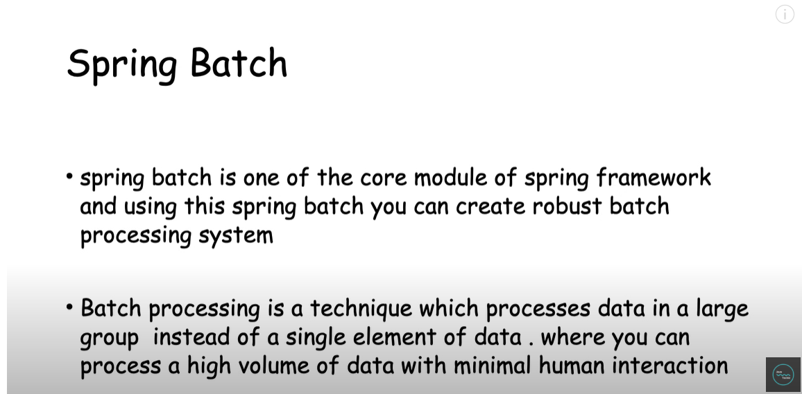
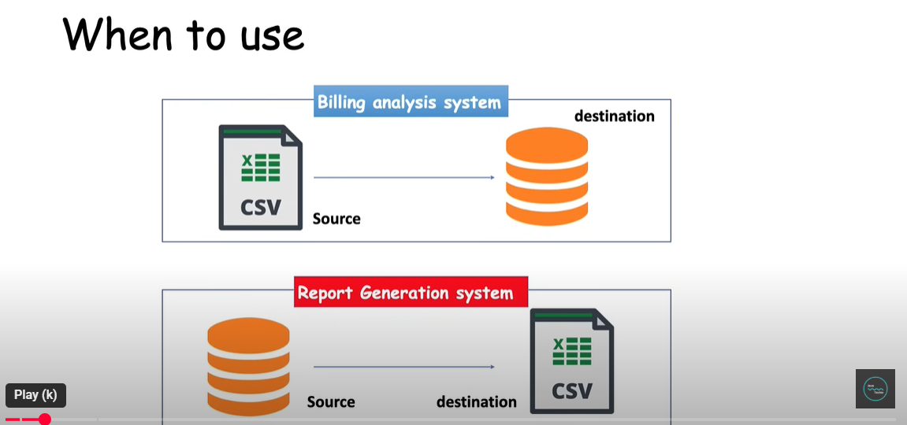
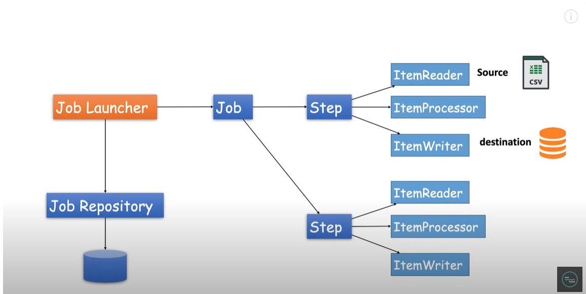
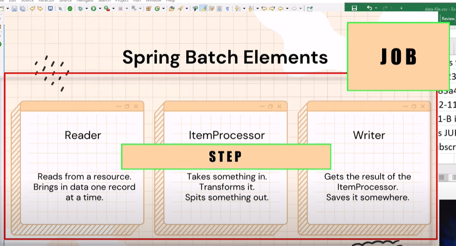
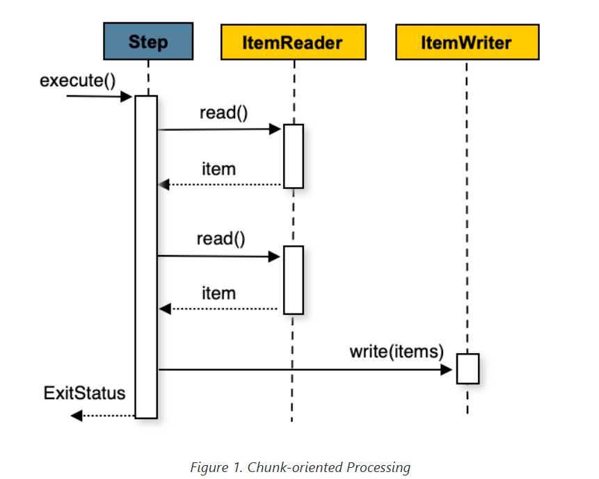
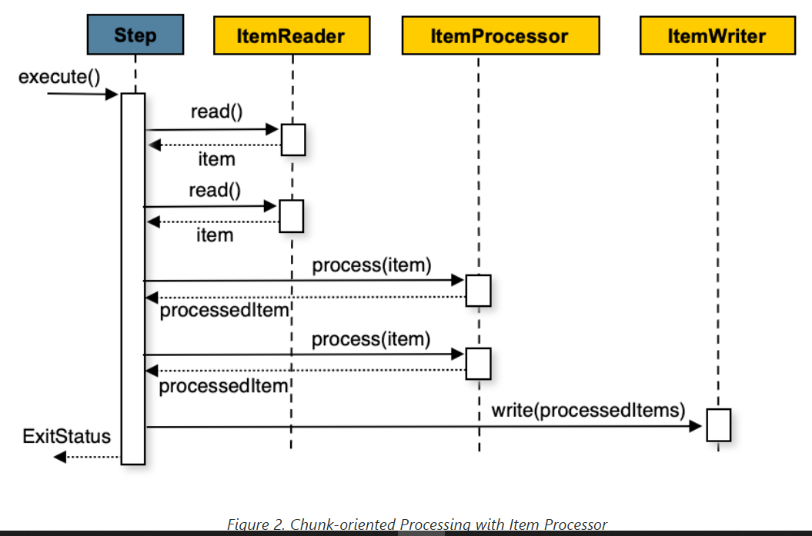

Spring Batch is a powerful batch processing framework built on top of the Spring Framework.
It is designed for processing large volumes of data in a reliable, scalable, and transactional manner.

### 🧠 Why Use Spring Batch?

Use Spring Batch when you need to:
- Process large volumes of records, such as data migration, report generation, or ETL.
- Ensure robust error handling, **retry**, and **transaction management**.
- Maintain job metadata and history (job runs, status, etc.).
- Execute **scheduled or recurring jobs** efficiently.

### 🕒 When to Use It?

Use it for batch-style tasks, such as:
- Reading data from a database or file, transforming it, and writing it somewhere else.
- Scheduled data processing (e.g., nightly report generation).
- Large imports/exports (e.g., CSV → DB, DB → Excel).

### ✅ Use Case

1.CSV to Database Importer
- Read users from a CSV file.
- Validate and transform the data.
- Write valid data to a database.

another use case can be
2.Generating reports(csv file) from database
- Read data from database
- Validate or process them
- Write data to a csv file

### Chunk-oriented Processing

Spring Batch uses a “chunk-oriented” processing style in its most common implementation.
Chunk oriented processing refers to **reading the data one at a time** and creating 'chunks' that are written out within a transaction boundary.
Once the number of items read equals the commit interval, the **entire chunk is written out by the ItemWriter**, and then the transaction is committed. 

The following image shows the process:

**pseudo code**:

List items = new Arraylist();   
for(int i = 0; i < commitInterval; i++)  
{  
    Object item = itemReader.read();  
    if (item != null) {   
        items.add(item);   
    }  
}  
itemWriter.write(items);     

You can also configure a chunk-oriented step with an optional ItemProcessor to process items before passing them to the ItemWriter.
The following image shows the process when an ItemProcessor is registered in the step:

**pseudo code**

List items = new Arraylist();  
for(int i = 0; i < commitInterval; i++)  
{  
    Object item = itemReader.read();  
    if (item != null) {  
        items.add(item);  
    }  
}  

List processedItems = new Arraylist();  
for(Object item: items){  
    Object processedItem = itemProcessor.process(item);  
    if (processedItem != null)   
    {    
        processedItems.add(processedItem);  
    }  
}  
  
itemWriter.write(processedItems);  

example link : https://medium.com/@elouadinouhaila566/understanding-spring-batch-a-comprehensive-guide-393904ac401c  
Ref spring doc Link : https://docs.spring.io/spring-batch/reference/index.html  